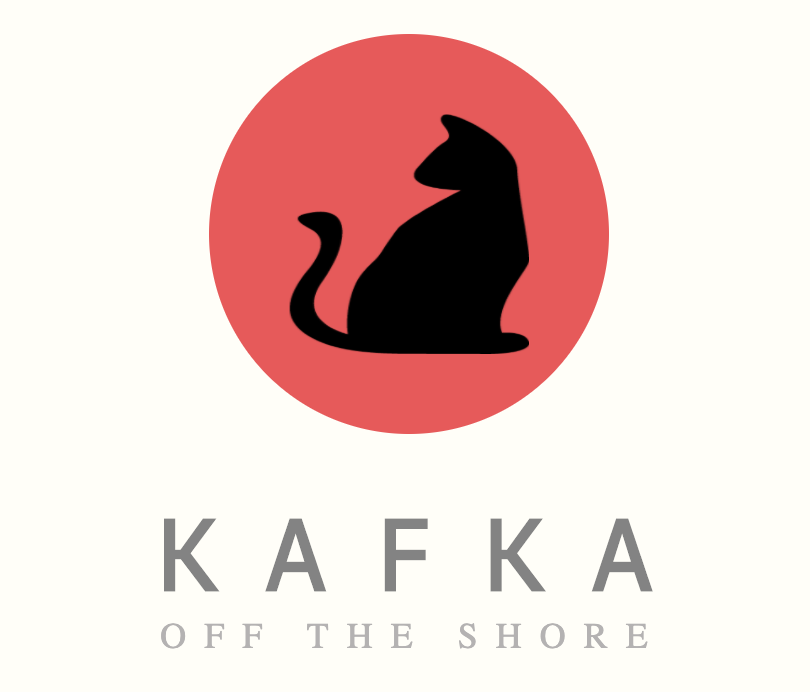

<p align="center">
  
</p>

## with Kafka, Zookeeper, Spark, CouchDB, FastAPI, Python, React and Chartjs
Here we are going to simulate a system using `Kafka` and `Spark` to examine its capability to handle continous data distribution, and at the
same time testing how `PouchDB` and `CouchDB` can do auto-sync between frontend and backend

### SCREENSHOTS
<p align="center">
  
  
</p>

<p align="center">
  
  
</p>


### SETUP
There are 11 components:
1. Kafka Brokers
2. Zookeeper
3. CMAK as Kafka WebUI Manager
4. CouchDB
5. User Frontend Application
6. Admin Frontend Application
7. Kafka Consumer
8. Backend API as Kafka Producer
9. Spark Master
10. Spark Worker
11. Apache Zeppelin


### Prerequisites:
1. Node, Npm
2. Make
3. Pipenv
4. Docker


### Setting up:

Basicall, run Make setup to install all dependencies and creating a docker network
``` shell
$ make setup
```

Given our CouchDB (must be exposed to localhost) with default Authentication config being used (refer to `./env/couchdb`)

Add CORS to CouchDB so AdminApp can sync with it

``` shell
$ make add_cors_couch
```
*Alternatively, when running as a docker service, CORS can be enabled using GUI from http://localhost:5984/_utils/#_config/nonode@nohost. Note that CouchDB Cluster Config might need some manual adjustment*

Using `CMAK` as Kafka-Manager to add **Cluster** then setup proper **partition-assignment** going to *http://localhost:9000*

### Getting up

1. Run the whole system
Use the following command to fire the system up *(and optionally scale the services - eg: 2 (k)afka-brokers, 3 (s)park-worker)*

NOTE: Each spark-executor will require 1 single-core from the CPU, so depend on your machine spec, you can have more or less
of them.

``` shell
$ make up-scale k=2 s=3
```

2. Submit the Spark application

If zookeeper and the brokers are ready to work, deploy the Spark app using.

``` shell
$ make submit_job
```

As the job has been succesfully deployed, go to `http://localhost:8080` and find the newly running application.

If you want to make any change to the job, just modify the scala codes in `./spark_job` and re-run the above command.


3. Start the frontend applications
Start frontend apps (*UserApp* and *AdminApp*) in 2 separated terminals, using 2 commands

``` shell
$ make fe_user
$ make fe_admin
```

4. Sending data to Kafka
Use the **UserApp** at `http://localhost:3001` to send data continously (stream of numbers) to *Backend-Producer*.

Alternatively you can go tob *http://localhost:8000/docs* and use *Swagger* to make api request.

5. Watching changes from frontend AdminApp
If the admin app is already running, go to `http://localhost:3002` and see changes if there are any messages being
streamed to *CouchDB*

6. Enjoy hacking on your own :)

### TODO
Considering what to add to complete the Architechture

- [x] Add CouchDB
- [x] Add **API Client App**
- [x] Add **Admin Client App** with PouchDB for db real-time tracking
- [x] Developing **Producer Backend API**
- [x] Add **Spark** to consumer, connect to **Kafka** for streaming
- [x] Scale Consumer
- [x] Scale Kafka Broker and Spark Worker
- [ ] Use gRPC for backend-producer
- [ ] Store calculated data from Spark to CouchDB
- [ ] Apache Beam?
- [ ] Apache Avro
- [ ] KSQL?
- [ ] Deploy everything with **Kubernetes**
- [ ] Stress-testing
